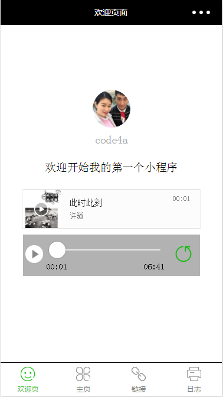
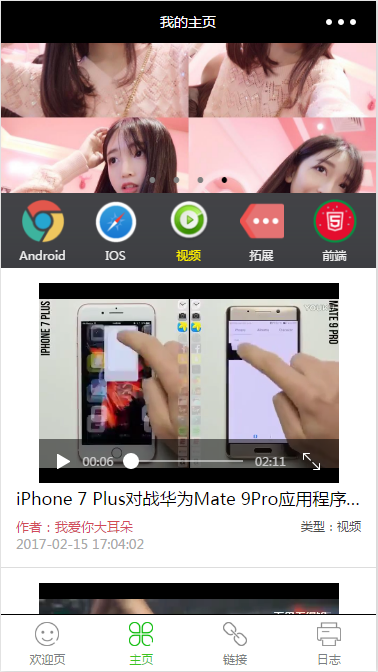

# wxapp-demofirst
微信小程序初探

## 欢迎页

* 页面的上半部分是自动生成的，修改了文字的位置，下边添加了一个音乐组件，添加了audio的`bindplay`,`bindpause`,`bindtimeupdate`事件，从而更新底部的**position**和**duration**以及slider的进度

* 控制器的左侧按钮支持状态变化，随着音乐的暂停播放更新状态，右侧的按钮测试从**[阿里通信图标库](http://www.iconfont.cn/collections/show/29)**中下载

### 预览

## 主界面

* 页面的上半部分是一个自动滚动的swiper
* 中间是一个导航条，
* 底部是内容列表，根据导航条当前的定位，去加载对应分类下的内容
* 单独处理视频分类，视频信息来源**[百思不得姐视频Api](http://api.budejie.com/api/api_open.php?a=list&c=data&type=41)**

      * type=1 : 全部
      * type=41 : 视频
      * type=10 : 图片
      * type=29 : 段子
      * type=31 : 声音
  
### 预览

