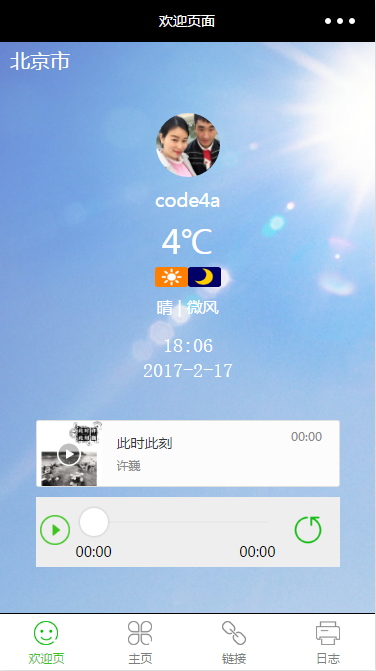

# wxapp-demofirst
微信小程序初探

## 欢迎页

* 页面的上半部分是自动生成的，修改了文字的位置，下边添加了一个音乐组件，添加了audio的`bindplay`,`bindpause`,`bindtimeupdate`事件，从而更新底部的**position**和**duration**以及slider的进度

* 控制器的左侧按钮支持状态变化，随着音乐的暂停播放更新状态，右侧的按钮测试从**[阿里通信图标库](http://www.iconfont.cn/collections/show/29)**中下载

### 预览

