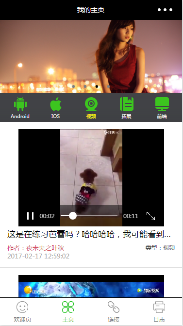

# wxapp-demofirst
微信小程序初探

## 欢迎页

* 页面的上半部分是自动生成的，修改了文字的位置，下边添加了一个音乐组件，添加了audio的`bindplay`,`bindpause`,`bindtimeupdate`事件，从而更新底部的**position**和**duration**以及slider的进度
* 中间部分是获取的当前城市，温度及时间
* 控制器的左侧按钮支持状态变化，随着音乐的暂停播放更新状态，右侧的按钮测试从**[阿里通信图标库](http://www.iconfont.cn/collections/show/29)**中下载

### 预览

## 主界面

* 页面的上半部分是一个自动滚动的swiper，支持点击图片更换banner资源，数据来自**[干货集中营 API 文档](http://gank.io/api)**的福利分类的1-100页的随机页面
* 中间是一个导航条，点击可切换内容区域，可随下部内容区域滑动切换而更新页面定位
* 底部是内容列表，根据导航条当前的定位，去加载对应分类下的内容，页面可滑动切换，滑动到底部加载更多数据
* 单独处理视频分类，视频信息来源**[百思不得姐视频Api](http://api.budejie.com/api/api_open.php?a=list&c=data&type=41)**
      * type=1 : 全部
      * type=41 : 视频
      * type=10 : 图片
      * type=29 : 段子
      * type=31 : 声音
      * 加载更多 : 添加两个字段 
		* page : 页码 (加载下一页需要)
		* maxtime : 获取到的最后一条数据的**maxtime**字段 (加载下一页需要)
  
### 预览

### 致谢

* [目前为止最全的微信小程序项目实例](http://blog.csdn.net/zuoliangzhu/article/details/53862576)
* [干货集中营 API 文档](http://gank.io/api)
* [阿里巴巴矢量图标库](http://www.iconfont.cn/plus/collections/index?spm=a313x.7781069.1998910419.3.oS4Wxy)
* [百思不得姐视频Api](http://api.budejie.com/api/api_open.php?a=list&c=data&type=41)
